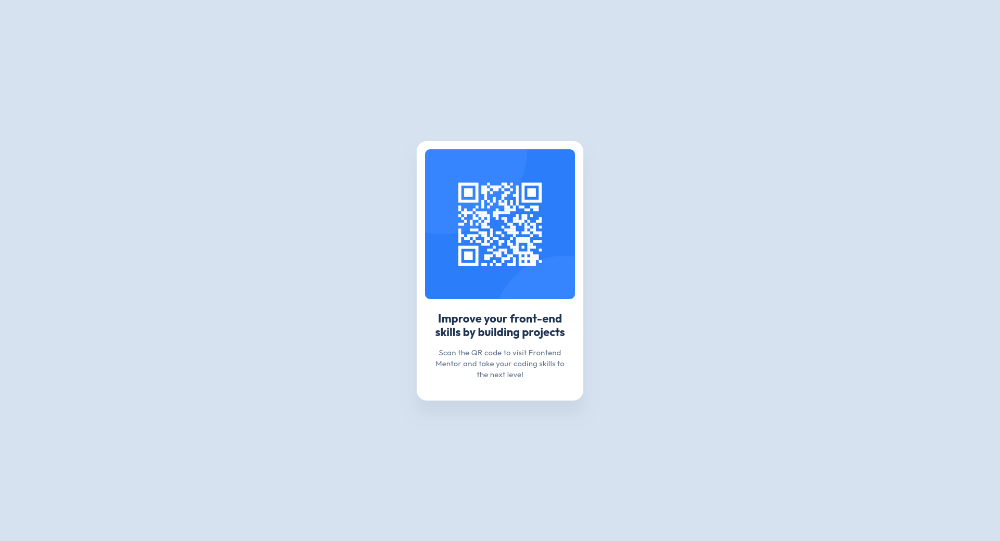

# Frontend Mentor - QR code component solution

This is a solution to the [QR code component challenge on Frontend Mentor](https://www.frontendmentor.io/challenges/qr-code-component-iux_sIO_H). Frontend Mentor challenges help you improve your coding skills by building realistic projects.

## Table of contents

- [Overview](#overview)
  - [Screenshot](#screenshot)
  - [Links](#links)
- [My process](#my-process)
  - [Built with](#built-with)
  - [What I learned](#what-i-learned)
- [Acknowledgments](#acknowledgments)

## Overview

### Screenshot

### Links

- [Solution URL](https://www.frontendmentor.io/solutions/qr-code-component-mPlGLAIb1d)
- [Live Site URL](https://ez-qr-code-component.netlify.app/)

## My process

### Built with

- Semantic HTML5 markup
- CSS custom properties
- Flexbox
- Mobile-first workflow
- [CUBE methodology](https://cube.fyi)
- [Further reading on Cube CSS ](https://piccalil.li/blog/cube-css/)

### What I learned

I wanted to put Andy Bell's CUBE methodology into practice.
Letting the design be the source of truth is a pleasant experience overall. So following the idea of declaring design
tokens as variables is a no brainer.

Next, base styles, which fall under **Composition**. The idea behind this is taking full advantage
of the cascade. I imagine a waterfall flowing down all the elements, and then putting things in the
waterfalls way to "re-route" it's direction, aka overwriting with specific styles you may need for a
particular element. Analogy may be flawed but it works for me!

- `body`, `h2`, and `p` were good candidates for this
- Setting global layout rules here would be ideal, but I created a utility class instead.

**Block** basically refers to components. In this case, the QR Code Card Component. So I gave it
styles that were specific to it, and allowed the cascade to do it's work. I did not have to create
styles for things like `card__title` or `card__image`. If you have good resets and base styles, it
seems the less work you have to do when creating components, with the added benefit of targeting
elements directly i.e `card > img` without worrying too much.

I then went ahead and created reusable **Utilities** for "ubiquitous" styles that do _one job well_.
This being a tiny project, I didn't necessarily see it's benefits, but utilities are a
sound concept, when it's necessary of course. Shoutout tailwindcss.

No **Exceptions**.

## Acknowledgments

- [Andy Bell](https://bell.bz)
- [Tailwind](https://tailwindcss.com)
